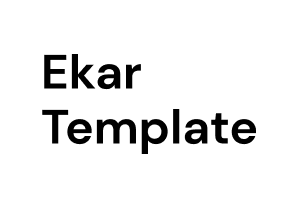

## **ekar template**
## 📷 A Photographer Personal Website Template

### **[Online preview](https://ekartemplate.netlify.app)**
 

## **Feature**
---
- [💚 Nuxt 3](https://nuxt.com/) - SSR, ESR, File-based routing, components auto importing, modules, etc.

- ⚡️ Vite - Instant HMR

- 🎨 [UnoCSS](https://github.com/antfu/unocss) - The instant on-demand atomic CSS engine.

- 😃 Use icons from any icon sets in Pure CSS, powered by [UnoCSS](https://github.com/antfu/unocss)

- 🔥 The `<script setup>` syntax

- 📑 [Layout system](./layouts)

- 📥 APIs auto importing - for Composition API, VueUse and custom composables.

- 🏎 Zero-config cloud functions and deploy

- 🦾 TypeScript, of course 

 

## **Try it now**
---
## Github Template
### **[Create a repo from this template on GitHub.](https://github.com/Ekarmore/ekar-template/generate)**